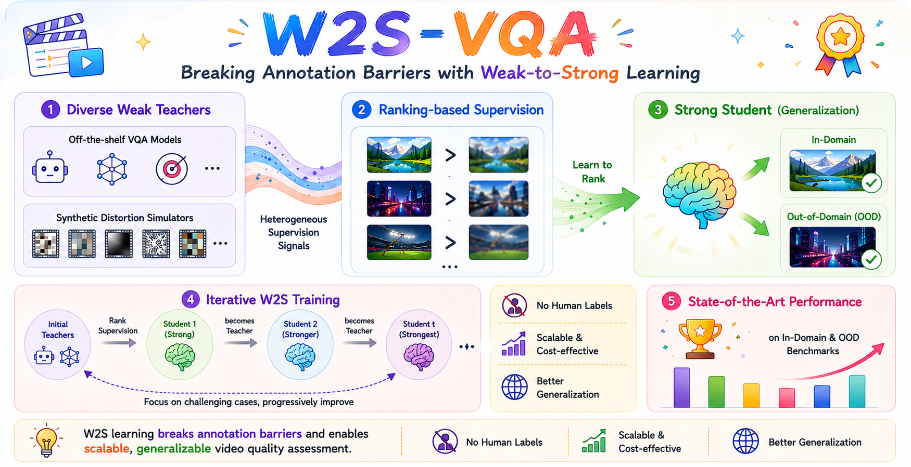

<div align="center">

# Generalizable Video Quality Assessment via Weak-to-Strong Learning

 <div>
    <a href="https://arxiv.org/pdf/2505.03631"></a>
    <a href="https://huggingface.co/kkkkkklinhan/llava_qwen_slowfast_w2s_stage3"></a>
   </div>

  <div>
      <a href="https://scholar.google.com/citations?user=WmE6necAAAAJ&hl=zh-CN" target="_blank">Linhan Cao</a><sup>1</sup><sup>*</sup>,
      <a href="https://scholar.google.com/citations?hl=zh-CN&user=nDlEBJ8AAAAJ" target="_blank">Wei Sun</a><sup>2</sup><sup>*</sup>,
      <a href="https://scholar.google.com/citations?hl=zh-CN&user=k7YfbnEAAAAJ" target="_blank">Xiangyang Zhu</a><sup>3</sup>,
      Kaiwei Zhang<sup>3</sup>,
      Jun Jia<sup>1</sup>,
      Yicong Peng</a><sup>1</sup>,
  </div>

<div>
      <a href="https://faculty.ecnu.edu.cn/_s47/zdd/list.psp" target="_blank">Dandan Zhu</a><sup>2</sup>,
      <a href="https://ee.sjtu.edu.cn/en/FacultyDetail.aspx?id=24&infoid=153&flag=153" target="_blank">Guangtao Zhai</a><sup>1</sup>
      <a href="https://scholar.google.com/citations?user=91sjuWIAAAAJ&hl=zh-CN&oi=ao" target="_blank">Xiongkuo Min</a><sup>1</sup><sup>#</sup>,
      
  </div>

  <div>
  <sup>1</sup>Shanghai Jiaotong University,  <sup>2</sup>East China Normal University, <sup>3</sup>Shanghai Artificial Intelligence Laboratory
       </div>   
<div>
<sup>*</sup>Equal contribution. <sup>#</sup>Corresponding author. 

<p align="center">
    
</p>


<div align="left">

## 🚀 Release
- [2026/05/20] 🔥 Released the code and weight.
- [2026/2/21] 🔥 Our paper is accepted by CVPR 2026!

## ⚙️ Installation

```bash
conda create -n w2s_vqa python=3.10 -y
conda activate w2s_vqa
pip install --upgrade pip
pip install -e ".[train]"
pip install pytorchvideo
pip install transformers==4.44.0 
```

## 🔍 Inference

You need to download the pre-trained model weights before running inference: 👉[llava_qwen_slowfast_w2s_stage3](https://huggingface.co/kkkkkklinhan/llava_qwen_slowfast_w2s_stage3).

Step 1: Extract SlowFast features.

```shell
cd slowfast_feature
python extract_slowfast_feature.py --feature_save_folder path/to/save_features --videos_dir path/to/videos
```

Step 2: Run inference.

The test JSON file should follow this format:

```json
{
  "annotations": [
    {
      "image_id": "B155.mp4",
      "ann_type": "score",
      "score": "43.497"
    },
    {
      "image_id": "A055.mp4",
      "ann_type": "score",
      "score": "53.809"
    },
    {
      "image_id": "G071.mp4",
      "ann_type": "score",
      "score": "48.371"
    }
  ]
}
```

```shell
python infer_pair.py
```

## 🧪 Training

You can further fine-tune based on our Stage 3 weights.
The training JSON file should be organized in the LLaVA format.

```shell
bash scripts/train/finetune_onevision_video.sh
```

## 📚 Citation

If you find this code is useful for your research, please cite:

```bibtex
@article{cao2025breaking,
  title={Breaking annotation barriers: Generalized video quality assessment via ranking-based self-supervision},
  author={Cao, Linhan and Sun, Wei and Zhang, Kaiwei and Peng, Yicong and Zhai, Guangtao and Min, Xiongkuo},
  journal={arXiv e-prints},
  pages={arXiv--2505},
  year={2025}
}

@article{cao2025towards,
  title={Towards Generalized Video Quality Assessment: A Weak-to-Strong Learning Paradigm},
  author={Cao, Linhan and Sun, Wei and Zhu, Xiangyang and Zhang, Kaiwei and Jia, Jun and Peng, Yicong and Zhu, Dandan and Zhai, Guangtao and Min, Xiongkuo},
  journal={arXiv preprint arXiv:2505.03631},
  year={2025}
}
```
